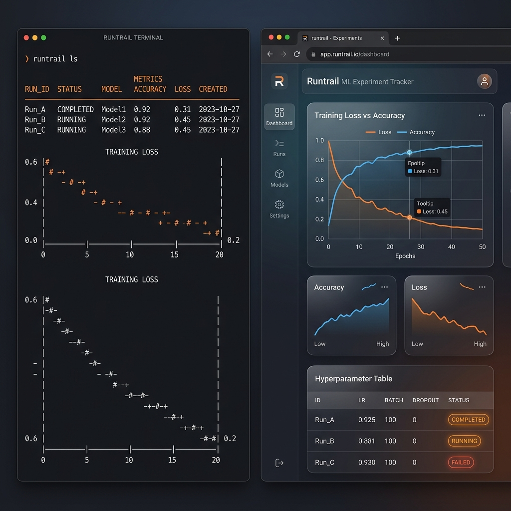

# runtrail

A local-first experiment tracker for solo ML researchers.



> **Status**: v0.1.0 — first public release. See the [changelog](CHANGELOG.md).

---

## What it is

runtrail is a single-binary, local-first experiment tracking tool that prioritizes **diffing** and **reproducibility** over team collaboration. Where W&B optimizes for organizations, runtrail optimizes for the individual researcher running 50–500 experiments and needing to understand what changed between them.

```python
import runtrail

run = runtrail.init(config={"lr": 0.1, "batch_size": 256})

for step in range(1000):
    loss = train_step()
    run.log({"loss": loss}, step=step)

run.finish()
```

```bash
$ runtrail ls
ID         STATUS  NAME          VAL_ACC  STARTED
run-a1f3   done    quick-test       —     just now

$ runtrail diff run-a1f3 run-b8e2

$ runtrail ui
# opens browser → full local web UI
```

## Core features

- **Zero setup** — one `pip install`, one decorator. No account, no cloud, no config.
- **Diff-first** — comparing two runs is the primary operation, not an afterthought.
- **Full reproducibility capture** — git state, environment, hardware, data hashes, all automatic.
- **Owns your data** — everything in `~/.runtrail/`, SQLite + Parquet, fully human-inspectable.
- **Local web UI** — `runtrail ui` serves a reactive dashboard, no separate server needed.
- **Offline forever** — no network calls unless you opt into sync.

## Install

```bash
# Python SDK
pip install runtrail

# Go binary (CLI + UI server)
# macOS
brew install runtrail/tap/runtrail

# Linux / Windows
# Download from https://github.com/runtrail/runtrail/releases
```

## Documentation

- [SDK reference](docs/sdk.md)
- [CLI reference](docs/cli.md)
- [Storage schema](docs/schema.md)
- [Architecture](docs/architecture.md)
- [Build spec](SPEC.md)

## Development

Requirements: Go 1.25+, Python 3.9+, Node.js 20+ (npm).

```bash
# Build everything
./scripts/build.sh

# Run tests
go test ./...
cd sdk && pytest -q
cd web && npm test
```

## License

Apache-2.0 — see [LICENSE](LICENSE).
